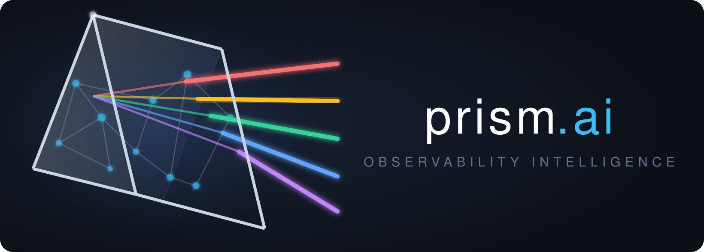

<p align="center">
    <a href="https://github.com/pakitoh/prism.ai">
        
    </a>
</p>
<p align="center" style="color:rgb(40,82,100);font-size:44px;font-weight:bold;">
    <span style="color:rgb(23,47,88)">Prism</span><span style="color:white">AI</span>
</p>

<p align="center">
  
  
  
  
</p>

## 📋 Table of Contents

- [Why](#-why)
- [Key Features](#-key-features)
- [Getting Started](#-getting-started)
- [AI Design](#-ai-design)
- [Stack](#-stack)
- [Contributing](#-contributing)
- [License](#-license)


## ✨ Why

An AI-powered observability investigation assistant. Feed it a metric anomaly, a log query, or an alert — it reasons through your telemetry stack, correlates signals across Prometheus, Loki and Tempo, and surfaces the root cause.

> **Prism:** raw, undifferentiated telemetry goes in. Focused, actionable signal comes out.


## 🔑 Key features

- **On-demand investigation** — ask "what's wrong with checkout-service in the last 30 minutes?" and get a structured root-cause analysis backed by live queries
- **Signal correlation** — autonomously chains metric → log → trace queries rather than forcing you to pivot between tools manually
- **Clickable evidence** — every gathered signal carries a Grafana Explore deep link, and the finding nominates a headline link to the key signal, so you can jump straight from the conclusion to the data
- **Growing memory** — past investigations are embedded in pgvector; recurring failure patterns surface their own history
- **Alert-driven (Phase 3)** — an alert fires and POSTs its webhook to prism.ai (`/alerts`, Alertmanager format — Prometheus Alertmanager or Grafana alerting); prism.ai investigates each firing alert and delivers a report
- **Remote MCP server (Phase 4)** — runs in the cloud with access to the company stack; developers connect Claude Code or Claude Desktop from their laptops and investigate in natural language

## 🤖 AI Design

### Why not RAG

A conventional RAG pipeline retrieves documents before the model reasons. That works well for knowledge bases and documentation search, but it's the wrong abstraction for incident investigation: you don't know which metrics to pull until you've seen the alert context, and you don't know which trace to fetch until you've seen the metric spike. The investigation is inherently sequential and context-dependent.

prism.ai uses **agentic tool-use** instead. The application drives a loop: it asks the model for the next step given the context so far, executes that step, incorporates the result, and continues until the model reaches a conclusion. Each step informs the next.

The loop itself is core business logic and lives in the application layer, not in the model adapter. The model only decides *one step at a time* — gather a specific piece of evidence, or conclude — and the application orchestrates everything else. The model and provider are configuration-driven (Google Gemini by default), from a configurable model list that is retried with round-robin rotation on error — including a cross-provider Groq fallback.

### Investigation loop

```
InvestigationRequest  (alert · free-text query · metric anomaly)
         │
         ▼
    next step? ◀─────────────────────────┐   (model decides one step)
         │                               │
         ├─ QueryMetrics(PromQL, window) → Prometheus HTTP API ──┐
         ├─ SearchLogs(LogQL, window)    → Loki HTTP API ────────┤
         ├─ GetTrace(traceId)            → Tempo HTTP API ───────┤
         ├─ SearchTraces(TraceQL, win)   → Tempo HTTP API ───────┤
         ├─ List{Log,Metric,Trace}…      → schema discovery ─────┤ record Signal
         ├─ SearchPastInvestigations(q)  → pgvector memory ──────┘   then loop
         │                               │
         └─ Conclusion ─────────────────────────────────────────▶ done
         │
         ▼
    Finding  (root cause · supporting evidence · recommended action)
```

A typical investigation: detect an error-rate spike → pull correlated logs → find an exemplar trace → identify the failing span and dependency. No manual pivoting between dashboards. A step limit guarantees the loop always terminates.

To keep the model from guessing datasource conventions, each investigation is **seeded** up front with the live schema — Loki log labels, Prometheus metric names, Tempo trace tags — so it queries `service_name` rather than a hallucinated `service`. The model can also discover labels/values on demand via the `list_*` tools.

### Asynchronous execution

That loop can take many model + telemetry round-trips, so it never runs on the request thread. The inbound side is split **command/query (CQRS)**: a command port submits work, a query port reads results. `submit` persists the investigation as `PENDING`, schedules the loop on a virtual-thread worker, and returns an id immediately (`202 Accepted`); clients poll the query port for status and result. The same two ports are what the alert webhook (Phase 3) and MCP server (Phase 4) drive — in-process, never over HTTP.

```
 POST /investigations ──▶ InvestigationCommandsUseCase.submit
                              │  open aggregate, save PENDING ──▶ InvestigationRepository ──▶ Postgres
                              │  schedule on virtual-thread worker
                              └▶ returns 202 + { id }              (does not block)

 ┌──────────────────────── background worker ─────────────────────────────┐
 │  ObservedInvestigationRunner  (span + metrics + lifecycle logs)         │
 │    └▶ RememberingInvestigationRunner  (store on conclude → MemoryPort)  │
 │         └▶ InvestigationLoop   ← the reasoning loop above               │
 │              │  ReasoningPort ▶ Metrics/Logs/Tracing/Memory ports       │
 │              └▶ save CONCLUDED / FAILED ──▶ InvestigationRepository     │
 └────────────────────────────────────────────────────────────────────────┘

 GET /investigations/{id}  ──▶ InvestigationQueriesUseCase.findById ──▶ Repository ──▶ Postgres
 GET /investigations?limit ──▶ InvestigationQueriesUseCase.recent
        (poll: PENDING ─▶ CONCLUDED / FAILED)
```

`InvestigationLoop` is the loop; it's wrapped — for both sync and async runs — by the observability and memory decorators (`InvestigationRunner` SPI), so cross-cutting concerns apply identically regardless of how a run was triggered. The domain and application layers stay free of any threading or framework code; the executor is wired at the composition root.

### Growing memory

Every completed investigation is embedded and stored in pgvector. When a similar failure recurs, the `search_past_investigations` tool surfaces relevant history — the original symptoms, the root cause, and what resolved it. Runbooks are not authored manually; they emerge from usage.

### Self-observability

prism.ai instruments itself with **OpenTelemetry** — the single telemetry façade — and exports its own traces, logs and metrics (OTLP) to the very stack it investigates: Tempo, Prometheus and Loki. The OpenTelemetry Spring Boot starter provides the SDK, auto-instrumentation (HTTP server, JDBC) and log↔trace correlation; custom spans are created through the OpenTelemetry API in `Observed*` decorators that wrap the ports, so the domain stays instrumentation-free. Because the loop runs asynchronously off the request thread, each investigation is its **own** trace — a `prism.investigation` root span with a `prism.reasoning.step` child per model decision (tagged with the model that answered), `prism.telemetry.query` children for the Loki/Prometheus/Tempo calls, and `prism.embedding` for memory — so a whole investigation is laid out as one tree, cross-linked to its `POST /investigations` request trace by a span link and a shared `investigation.id`. Per-stage duration histograms (`prism.*.duration`, tagged by outcome / step kind / backend) are exported alongside, and each `prism.reasoning.step` records the model id — so you can see which model is slow, failing, or meandering. The running build is identifiable too: the git commit is logged at startup and exposed at `/actuator/info`.

Agent-quality evaluation via [Langfuse](https://langfuse.com) — scoring each investigation's reasoning — is planned for a later phase.


## 🚀 Getting Started

```bash
# Copy environment file
cp .env.example .env           # set UID/GID

# Start the full observability stack
docker compose up -d

# Verify everything is healthy
docker compose ps
```

> The Postgres container creates the database schema on first startup from
> [`scripts/prism-db-init.sql`](scripts/prism-db-init.sql) via `docker-entrypoint-initdb.d`
> — the app runs no DDL. This fires only when the data directory is empty, so to
> apply later schema changes, clear the bind mount and restart:
> `docker compose down && sudo rm -rf data/postgres && docker compose up -d`.

Services after startup:

| Service | URL |
|---|---|
| Grafana | http://localhost:3000 |
| Prometheus | http://localhost:9090 |
| Loki | http://localhost:3100 |
| Kafka UI | http://localhost:8080 |
| Schema Registry | http://localhost:8081 |
| OTLP (gRPC) | localhost:4317 |
| OTLP (HTTP) | localhost:4318 |


## 🏗️ Stack

| Layer | Technology |
|---|---|
| Observability | Prometheus · Loki · Tempo · Grafana · OpenTelemetry Collector |
| Observability APIs | Prometheus HTTP · Loki HTTP · Tempo HTTP |
| LLM | Google Gemini (default) + Groq cross-provider fallback · retry with model rotation · provider/model configurable |
| Vector memory | PostgreSQL + pgvector |
| Alert ingestion | Alertmanager-format webhook (`POST /alerts`) — Prometheus Alertmanager or Grafana alerting |
| MCP interface | MCP Java SDK — Streamable HTTP transport |
| Application | Java 25 · Maven · Spring Boot 4 |
| Self-observability | OpenTelemetry (traces + logs) · Micrometer metrics · OTLP → its own Tempo · Prometheus · Loki |


---
### Project structure

```
prism-domain/          Domain model — pure Java, zero framework deps
prism-adapters-in/     Inbound adapters: REST, MCP server, alert webhook
prism-adapters-out/    Outbound adapters: model reasoning, Prometheus, Loki, Tempo, Postgres, pgvector
prism-boot/            Spring Boot wiring and configuration
```

See [PLAN.md](PLAN.md) for implementation phases.


---
### Architecture

Hexagonal architecture with a clean domain core. The investigation domain has no knowledge of Prometheus, the alert webhook, or the model — it only knows about signals, findings, and investigations. Adapters translate between the domain's port interfaces and external systems.

```
  REST / MCP server (Streamable HTTP) / alert webhook
               │
        [Inbound Adapters]
               │
          [Domain Core]
               │
       [Outbound Port Interfaces]
               │
   model reasoning · Prometheus · Loki · Tempo · Postgres · pgvector
```

## 🤝 Contributing

Contributions are welcome. Fork the repo, create a feature branch, and open a PR. Please include tests for any new behaviour and ensure the existing test suite passes.


## 📄 License

GPL — see [LICENSE](LICENSE).
